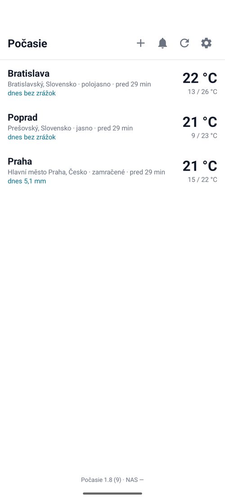
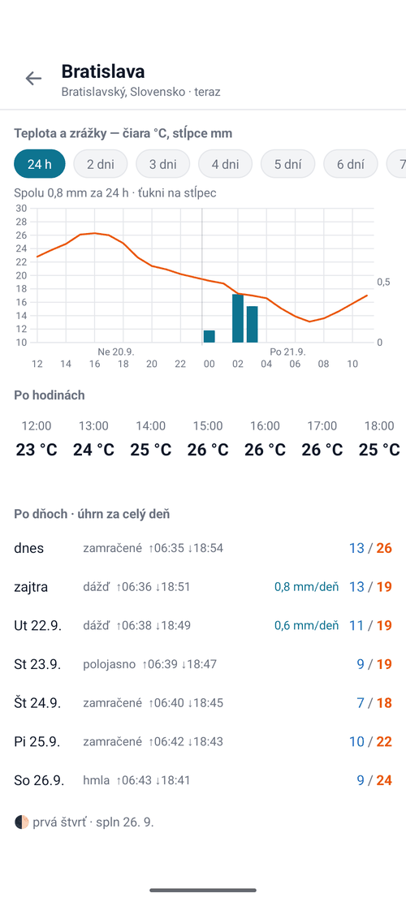
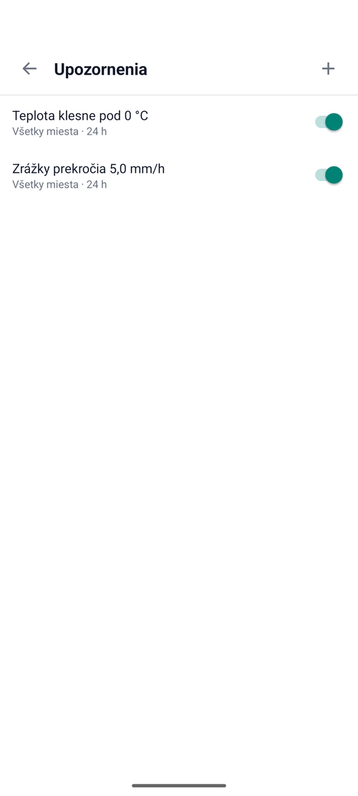

# Počasie (Weather)

A weather forecast for the places I pick, with **alerts for temperature and
rain** — built around one rule: download as little data as possible.

Android · Kotlin · Views + home-screen widget · minSdk 26 · 79 unit tests

Data comes from [Open-Meteo](https://open-meteo.com) — no key, no registration.
The phone's location is never used, so the app asks for no location permission.

## What it looks like

| The places I watch | One place in detail | Alerts |
|---|---|---|
|  |  |  |

The chart is one drawing, not two: the line is the temperature, the bars are
the millimetres, and tapping a bar says which hour it belongs to. Below it the
same data twice — by the hour for today, by the day for the week, with sunrise,
sunset and the moon phase.

The interface is Slovak. The forecast above is the real one for the three
places in the screenshot, taken on 20 September 2026.

## Why another weather app

Because the ones I had downloaded something every time I looked at them, and
most of the time I just wanted to see what was already on the phone. So the
question here was: how little can a weather app download and still be useful?

## How much it downloads

Measured on the wire (after gzip):

| Setting | on the wire | uncompressed |
|---|---|---|
| 7 days + hourly (default) | **1 337 B** | 6 679 B |
| 3 days, no hourly | **361 B** | 753 B |

With four places refreshed every 3 hours that is about **1.3 MB a month**.
It is five small decisions, not one trick:

1. **Only the fields the app actually draws are requested** — six variables
   out of dozens.
2. **Number of days and the hourly strip can be switched off.** The hourly part
   is about two thirds of the response.
3. **Cache on disk.** The list is drawn from the last download; a new one is
   made only when the old one is stale.
4. **Alerts download nothing** — they run over the forecast that is already
   there. Otherwise every rule would cost another request.
5. **Opening the app on mobile data downloads nothing.** Only ↻ or pull to
   refresh does. On Wi-Fi nothing changes.

The morning download runs at a fixed hour (6:00 by default) and **only on
Wi-Fi**; if there is no Wi-Fi at that moment it waits for the next one.

Settings show **data used, split into Wi-Fi and mobile**. One combined number
would hide the only question the counter is there for: *did the app download
something that cost me money?*

## The chart

One chart, two values: bars are rain (mm, right axis), the line is temperature
(°C, left axis). Range from 24 h to 7 days, drag a finger to see the exact hour.
The grid density follows the available space, not the range — the code picks
the densest step from 1, 2, 3, 6, 12 h at which the labels still don't overlap.

The widget draws **the same chart** — the drawing code is shared (`GrafKresba`),
so the app and the home screen can never look different. The widget gets it as
a `Bitmap`, because `RemoteViews` cannot host a custom `View`, and it never goes
to the network by itself.

## Two bugs that killed the widget completely

Both were there from day one and showed up only when I really added the widget
to a home screen on Android 10:

1. **`setNumColumns` through `RemoteViews`** is only "remotable" from Android 12.
   On older versions the host rejects the whole layout and shows *"Problem
   loading widget"*. The column count now lives only in the layout XML.
2. **An immutable collection template.** `setPendingIntentTemplate` with
   `FLAG_IMMUTABLE` drops the fill-in intent of each row, so the detail screen
   opened with an empty id and closed straight away — tapping a row looked like
   it "did nothing".

The same pair is waiting in every app that has a collection in a widget, so
both are now written down in the [shared standard](docs/shared-standard.md).

## One that almost got through

The hourly forecast starts at **midnight of today**, not at the current hour.
Checked live at 23:00: the first entry was `00:00`. Taking the first hour as
"now" would run the alerts over a day that is already over — the app would warn
at eleven in the evening about morning fog. "Now" is therefore taken from
`current.time`, in **the time zone of that place**, not from the phone's clock.

## Where things are

| File | Responsible for |
|---|---|
| `Predpoved.kt` | model and response parser — no Android, testable |
| `Graf.kt` | chart data: scales of both axes, day borders, ranges — pure logic |
| `GrafKresba.kt` | the drawing itself — one place for the app and the widget |
| `Upozornenie.kt` | alert rules and their evaluation — pure logic |
| `Mesiac.kt` | moon phase, computed instead of downloaded (±half a day) |
| `OpenMeteo.kt` | the only place where anything is downloaded |
| `Prenos.kt` | Wi-Fi / mobile data counter, shared by all my apps |
| `Obnova.kt` | WorkManager |

## Build

```
./gradlew :app:assembleDebug
./gradlew :app:testDebugUnitTest    # 79 tests
```

The UI is in Slovak. The original Slovak README with the version history is in
[README.sk.md](README.sk.md).
